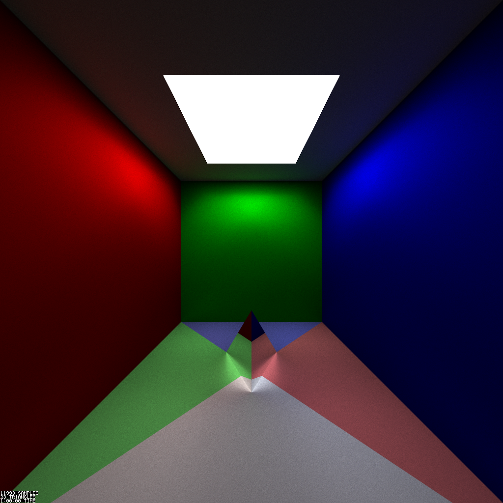

```
GPU Path Tracer 0.1
A path tracer on the GPU

USAGE:
    path-tracer-gpu.exe [FLAGS] [OPTIONS] --output <OUTPUT> --resolution <RESOLUTION> --scene <SCENE>

FLAGS:
    -d, --debug          Add information about the scene and render to image
    -h, --help           Prints help information
    -p, --progressive    Perform a progressive render that will continue until stopped
    -V, --version        Prints version information

OPTIONS:
    -m, --max-samples <SAMPLES>      The maximum number of samples to process
    -o, --output <OUTPUT>            The file to render to
    -r, --resolution <RESOLUTION>    The resolution of the render, as width:height
    -s, --scene <SCENE>              The scene to render
    -t, --time-limit <TIME>          The maximum number of time to render for, as h:m:s
```

Example render


